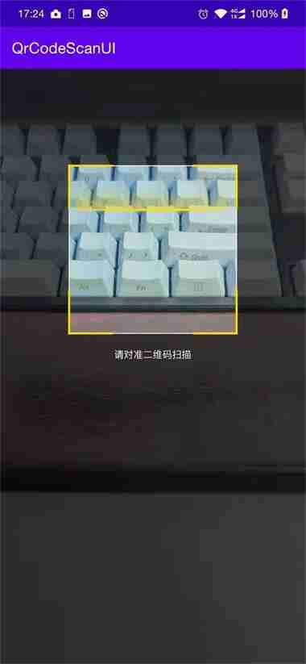

## QrCodeScanUI

Android 二维码扫码UI

鉴于当前出现了微信扫码库、华为扫码统一服务 等 二维码解析库，且比原本的纯ZXing的二维码解析 识别率、识别速度有很明显的提升，所以有着将扫码库迁移到微信扫码库、华为扫码统一服务的需求，但是他们都是没有扫码UI的，故创建`QrCodeScanUI`，将 **[BGAQRCode-Android ](https://github.com/bingoogolapple/BGAQRCode-Android)**和 **[ZXingLite](https://github.com/jenly1314/ZXingLite)** 中的扫码UI独立抽离取来，使其能独立使用，从而对接其他的扫码解析库。  

UI效果如下图所示



### 添加依赖

#### **Step 1.** Add the JitPack repository to your build file  

Add it in your root build.gradle at the end of repositories:

```groovy
allprojects {
		repositories {
			...
			maven { url 'https://www.jitpack.io' }
		}
	}
```


#### **Step 2.** Add the dependency

```groovy
dependencies {
    implementation 'com.github.EthanCo:QrCodeScanUI:v1.0.0'
}
```

### 如何使用

有两个扫码UI类可以选择，`ViewfinderView`或`ScanBoxView`，这两个类都可以实现相似的效果，可自行进行选择。  

#### ViewfinderView

```xml
<com.heiko.scan.ViewfinderView
        android:id="@+id/viewfinderView"
        android:layout_width="match_parent"
        android:layout_height="match_parent"
        app:cornerColor="@color/colorYellow"
        app:cornerRectHeight="25dp"
        app:cornerRectWidth="5dp"
        app:frameColor="@color/transparent"
        app:frameGravity="center"
        app:frameHeight="@dimen/scan_rect_width"
        app:framePaddingBottom="10dp"
        app:frameWidth="@dimen/scan_rect_width"
        app:gridHeight="0dp"
        app:labelText=""
        app:labelTextLocation="bottom"
        app:labelTextSize="14sp"
        app:labelTextWidth="180dp"
        app:laserColor="@color/colorYellow"
        app:laserStyle="line"
        app:maskColor="#7F000000" />
```


#### ScanBoxView

```xml
<com.heiko.scan.ScanBoxView
        android:layout_width="match_parent"
        android:layout_height="match_parent"
        android:layout_gravity="center"
        app:qrcv_animTime="1000"
        app:qrcv_borderColor="@android:color/white"
        app:qrcv_borderSize="1dp"
        app:qrcv_cornerColor="@color/colorYellow"
        app:qrcv_cornerLength="60dp"
        app:qrcv_customScanLineDrawable="@mipmap/icon_scan_line"
        app:qrcv_isOnlyDecodeScanBoxArea="false"
        app:qrcv_isTipTextBelowRect="true"
        app:qrcv_maskColor="#A1000000"
        app:qrcv_qrCodeTipText="请对准二维码扫描"
        app:qrcv_rectWidth="225dp"
        app:qrcv_scanLineMargin="8dp"
        app:qrcv_tipTextSize="13sp"
        app:qrcv_topOffset="130dp" />
```

